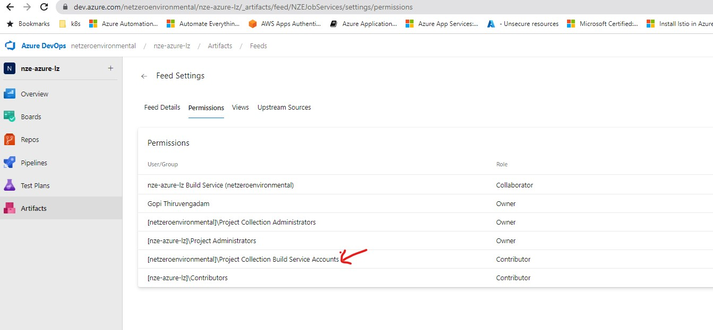
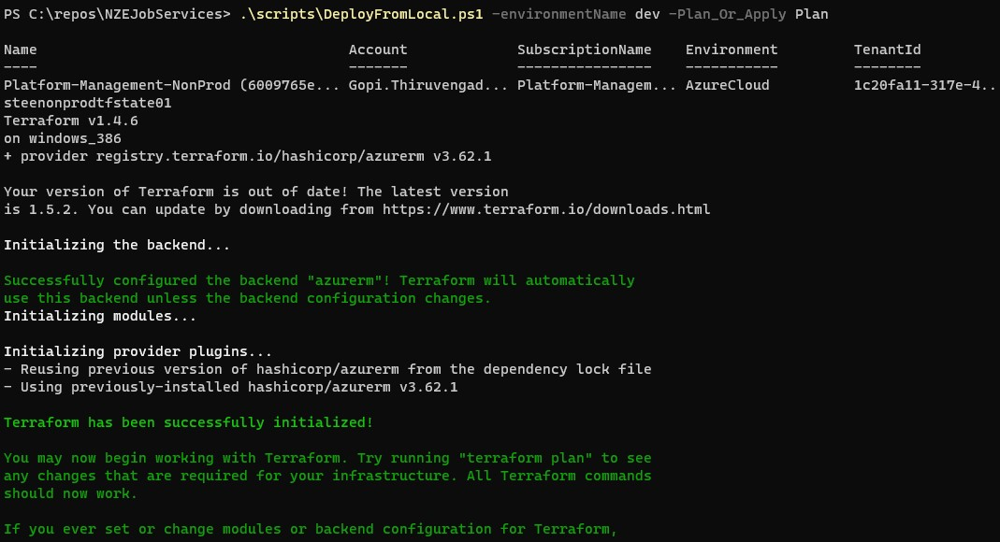
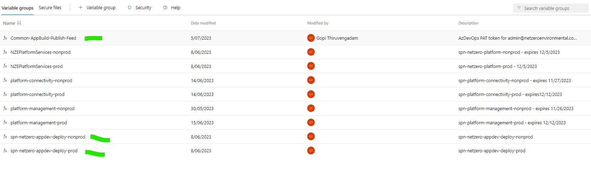

# NZEJobServices


## Building a service
For later when converting to generic template, fill out points into details

### A clear focus per service
* work with a single contained area, such as all the job operations
* are other items related or owned by
* no need to know about how anything else works, lowered complexity
* references to other items, but should be up to consumers to decide if they need to retrieve that data from the
  appropriate service

### The importance of a good API specification
* defining type structure
* specification of required and optional values, informs the consumer on how to process
* complete in cases, success error and unexpected scenarios
* consumer tools to automatically generate calls and required type structures
* versions of api, backwards compatibility.


## Application configuration
The move to .NET core has brought a few language features to simplify definitions and this is very obvious in the move
away from the traditional `Startup.cs` method of initialising a web app project. Default templates now use the C# 9
top-level statements feature and perform application initialisation in the `Program.cs` file.

There are several key components that we work with here through the `Microsoft.AspNetCore.Builder.WebApplication`
builder, mainly we are concerned with the `Configuration` `Logger` and `Services` properties for setting up our
application.

### Configuration
This is where we deal with accessing the provided parameters to the application, values will include items such as
database connection string, environment terms or other setup values provided to us from the Azure environment.

Initially, values are taking from the set of `appsettings.{environment}.json` files in the runtime application directory,
where `environment` can be specified with the dotnet `--environment` flag.

When deploying to an Azure environment the settings file will be included in the deployment, however any defined values
will be overwritten by those specified in the azure web app environment. It is recommended that users make use of the
app settings files for local development and testing, and that these keys match those specified in the deployment
environment so that confidential values (such as database connection strings etc) can be kept secret.

### Logger
the `ILogger<T>` interface in the service allows us to work with a variety of log output sources, in development this
will generally be the application console, however in the deployed azure environment this will also include our Azure
Application Insights integration.

The Application Insights integration will look for some default configuration values within the web apps deployed
environment and should be the recommended approach. However for reference connection values can be defined and handled
within the application code itself, this may have some use in the development phase of a feature.

### Services
The services property is where we set up application level services that will be provided to our components such as our
controllers in a dependency injection fashion. For more information on how dependency injection functions in C# see
[.NET dependency injection](https://learn.microsoft.com/en-us/dotnet/core/extensions/dependency-injection)

The main service we will be constructing is our database context, as this is a service that would need to be shared
among multiple controllers (if defined) and needs access to application configuration values such as its connection
strings and table names etc to correctly initialise, this can be seen in our example `Program.cs` file where an options
builder is used to initialise the context in an environment related fashion.

### Cross origin requests
In most circumstances it is important to understand and configure this correctly within the service, however since all
control will be put behind Azure API management we can be permissive with our allowed origins here and control access
to the service through Azure VPC and other policies as the service will not itself be publicly exposed.

## Swagger and OpenAPI
The most important integration part of this project is its generation of an API contract, which is handled through the
use of the OpenAPI specification and the swagger toolset a collection of tools made freely available by its creators
for creating an OpenAPI specification, with the Microsoft documentation making use of the Swashbuckle ASP.NET Core
package.

There are a few options we set aside from simply enabling the swagger generator, namely around the specification of
enumeration types, as the project directive `<GenerateDocumentationFile>true</GenerateDocumentationFile>` to create
the output it will work with. This provides us with both a specification that can be used in other projects and
automated tooling, as well as a UI with which to explore and test our definitions.


## Creating Controllers
`ControllerBase` extended classes are the core of how the api gets defined, there are a few key attributes that we want
to make use of at the class and method levels as well as some general notes about method structures:

### Key class attributes
* ApiController, defines that a class is part of the api definition
* Route("value") determines what path the controller and its defined methods are exposed on, the value of `[controller]`
  defines that the class name sans the "Controller" segment will be used (i.e. `JobController` becomes the path `/job`)

### Key method attributes
* http verb (get/post/put/delete)
* produces, narrows return type of specification
* ProducesResponseType, should be one present for each return code and structure expected.

### Other setup concerns
* return type for the 200 success case is implicitly taken from the method return type
* all operations within a method should be asynchronous, an instance services many calls and a request should not be blocking
* define default parameter values in your method definition, the API will pick up on these
* automatic validation of input parameters (automatic enum conversions as well etc)

see [controller based apis](https://learn.microsoft.com/en-us/aspnet/core/web-api/?view=aspnetcore-6.0)

## Creating Contexts
Contexts are the layer that interacts with the data source on our behalf, and this is achieved through the use of the
inbuilt EntityFramework.

* using in-memory for development and testing
* passing options to base context
* context is basically a table or document
* wrapping of data operation handling is recommended
* migrations see older CosmosDB considerations

## Creating DTOs (Data Transfer Objects)
* Are a recommended part of the Entity Framework
* Returned in place of context level objects, applications should not be working directly with the data storage format
* TODO other notes about construction here
* see [create data transfer objects](https://learn.microsoft.com/en-us/aspnet/web-api/overview/data/using-web-api-with-entity-framework/part-5)

## Older CosmosDB Considerations
These notes are for addressing the multi tenant connection through one deployed service scenario, currently made
obsolete due to moving the microservices inside the tenant definition. If a return to this strategy is ever required
the notes on the setup can be found below.

* if using the code first approach, what will the permissions have to look like for cosmosDB end
* between code first or import from db across scenarios, code first is the preferred method
* create an example of code first that can apply the migrations across multiple downstream data sources
* references
  * https://learn.microsoft.com/en-us/ef/core/managing-schemas/migrations/providers?tabs=dotnet-core-cli
  * https://stackoverflow.com/questions/74321637/applying-ef-core-migration-for-multiple-databases-dynamically-multitenancy
  * https://stackoverflow.com/questions/23073960/auto-migrations-to-dynamic-contexts-for-multi-tenant-databases?rq=4
  * https://nickcraver.com/blog/2016/05/03/stack-overflow-how-we-do-deployment-2016-edition/#database-migrations (from 7 years ago but for stack overflow itself)
* this with different classes per tenant would work for creating migrations
  * https://learn.microsoft.com/en-us/ef/core/managing-schemas/migrations/providers?tabs=dotnet-core-cli
  * how this works:
    * will need a class per context
    * each context could then look for its required environment values to populate the connection
    * have context service return a base context and let the lookup happen per tenant, maybe this part can be smart by using reflection and no tenant case to 404 as fallback?

## Generic project build targets
A note on how to target the test or service portion of the repository in a generic manner
* building service:`dotnet build **/*Services/*.csproj`
* building tests: `dotnet build **/*Tests/*.csproj`
## Azure Pipelines Pre-req

- Create a feed in Azure DevOps and provide permissions as outlined in https://learn.microsoft.com/en-us/azure/devops/pipelines/artifacts/nuget?view=azure-devops&tabs=yaml#publish-nuget-packages - refer to the below screen shot for this repo.

 
- Install Dotnet SDK 7 on DevOps VM and add dotnet source using
  ```dotnet nuget add source https://api.nuget.org/v3/index.json -n nuget.org```
- Install az cli and run ```az extension add --name azure-devops``` on DevOps VM.

## Local Setup - IAC Only
To test the code locally follow the below steps for IAC only.
- Login to Azure using az cli on PowerShell Core - Linux or Windows workstation.
- Login to Azure using PowerShell - Linux or Windows workstation
- Run the below script from the main folder location as shown below
  
  

## SPN Permission Summary
|             SPN-Name               | Scope                                | 🔰 Required Permissions                              |
| --------------------------         | :---------------------:              |      :------------------:                             |
| spn-netzero-appdev-deploy-nonprod  |    Sub-Netzero-NonProd               |               Website Contributor                     |
| spn-netzero-appdev-deploy-nonprod  |    Sub-Platform-Management-NonProd   | Log Analytics Contributor, Storage Account ontributor |
| spn-netzero-appdev-deploy-nonprod  |    Sub-Platform-Connectivity-NonProd |               Private DNS Zone Contributor            |
| spn-netzero-appdev-deploy-prod     |    Sub-Netzero-Prod                  |               Website Contributor                     |
| spn-netzero-appdev-deploy-prod     |    Sub-Platform-Management-Prod      | Log Analytics Contributor, Storage Account ontributor |
| spn-netzero-appdev-deploy-prod     |    Sub-Platform-Connectivity-Prod    |               Private DNS Zone Contributor            |

## SPN Credentials Reference

The SPN credentials are stored in the variable group and can be accessed via https://dev.azure.com/netzeroenvironmental/nze-azure-lz/_library?itemType=VariableGroups 
The sensitive portion of the credential - client_secret is encrypted and can't be viewed by anyone after its updated.



#### Note: The SPN creds will expire at sometime in the future after which the pipelines can't make API calls via Terraform - implies that the pipelines will fail. The SPN secret needs to be reset and the corresponding variable group secret needs to be updated. The expiry of the SPN is noted in the variable group and can also checked in Azure AD.

#### Note: The value for PAT environment variable is set via variable group `Common-AppBuild-Publish-Feed` and is being used to publish/update feeds during build.